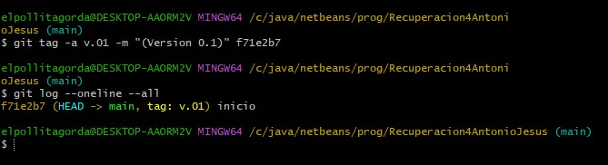
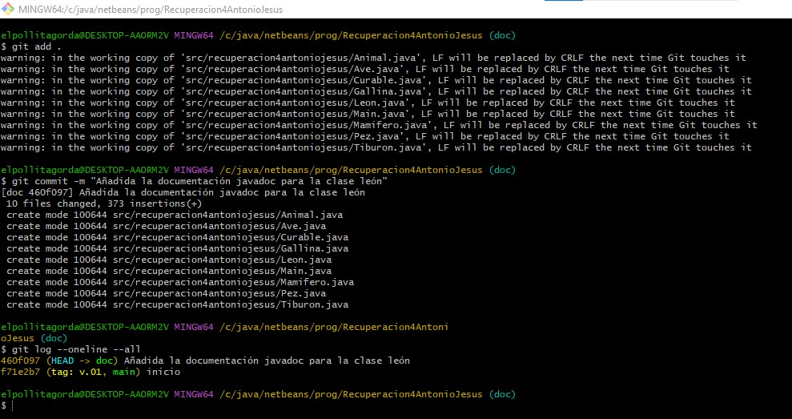
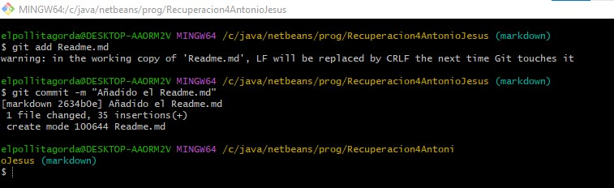
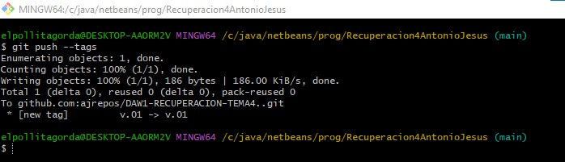
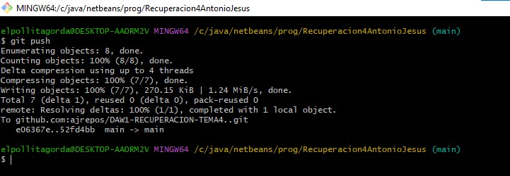
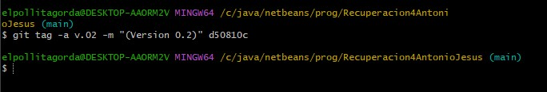
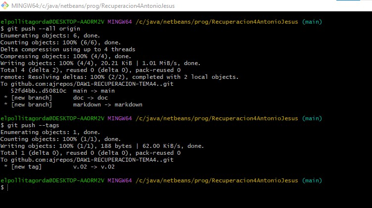

# RECUPERACION DE TEMA4 - ENTORNOS DE DESARROLLO

**_DOCUMENTACIÓN, OPTIMIZACIÓN Y CONTROL DE VERSIONES_**

## Antonio Jesus Alguacil Espejo

### EJERCICIO 1

### EJERCICIO 2

### EJERCICIO 3

### EJERCICIO 4

### EJERCICIO 5

### EJERCICIO 6

### EJERCICIO 7

